
<h1 align="center">实验室课程管理系统</h1>

## 简介
实验室课程管理系统，多角色支持，涵盖课程管理、教师与学生信息管理、实验室统计、设备借用和课程发布功能，优化实验室资源调配和教学管理。    --计算机毕业设计源码；毕设源码；java毕业设计源码

## 联系方式

<h3 align="center">获取完整代码与数据库文件 + 微信：deepguan QQ: 86050149 QQ群: 783742310</h3>

<h3 align="center">可帮忙远程部署 包运行成功！提供远程部署、修改代码、设计文档指导、代码讲解等服务！</h3>

## 功能介绍（完整见运行截图）
管理员：实验室课程管理系统允许管理员登录和注册账户，提供教师管理、学生管理、实验室信息管理、实验课程管理、预约记录管理和实验成绩管理等多项功能模块。管理员可以管理实验室设备的借用记录，包括录入设备信息、查看设备使用情况并进行更新操作。实验室信息和课程安排也由管理员负责维护，确保信息准确和实时更新，通过多种条件筛选实验室资源，优化预约和使用效率。

教师：教师可以通过该系统进行账户登录，进入系统后能够发布和管理课程细节，包括填写课程名称、实验资料上传、安排课程时间和提交相关信息。系统提供实验室信息查询功能，并允许教师进行实验室预约和课程安排，方便教师高效管理课堂资源。课程成绩的录入与管理功能也为教师提供便利，便于教师维护和更新学生的实验成绩和实验纪律记录。

学生：学生用户可以在系统中注册和登录账户，进入个人中心后查看个人信息并进行修改。系统为学生提供实验课程的预约功能，可以根据课程安排查看自己的实验课程时间和地点，增强实验课程参与度。学生还能通过系统获取课程的基本信息和实验室预约记录，方便统筹实验学习。

访客：无需登录的访客可以查看部分实验室课程管理系统的功能介绍和概览页面，了解系统提供的服务和模块，尤其是在适当范围内展示实验室信息和课程资源概况。访客界面往往显示注册和登录选项，以鼓励访客进一步参与到实验室课程管理中来，体验更多个性化和内部服务。

## 运行截图
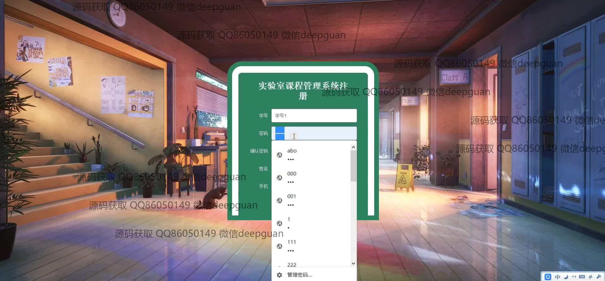
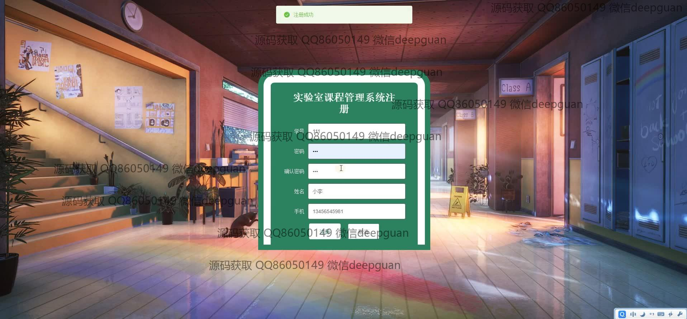
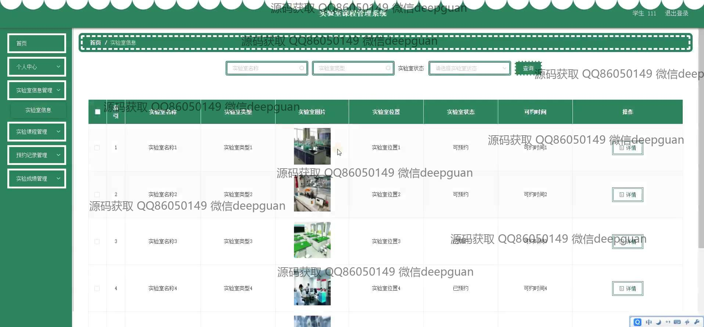
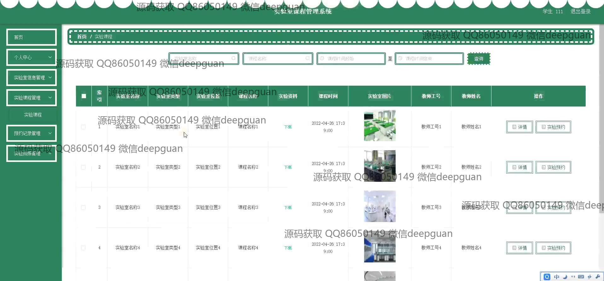
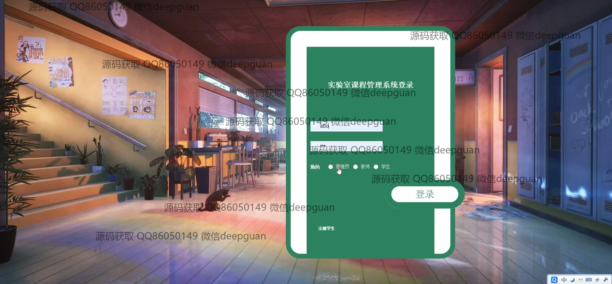
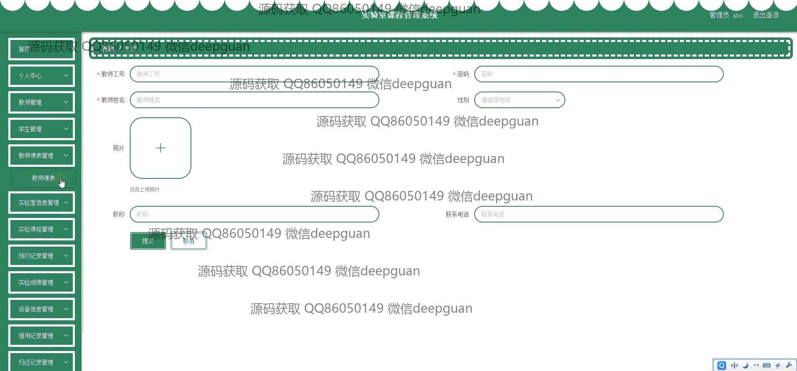
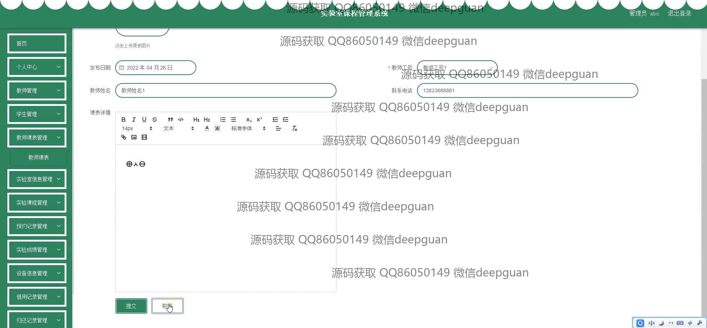
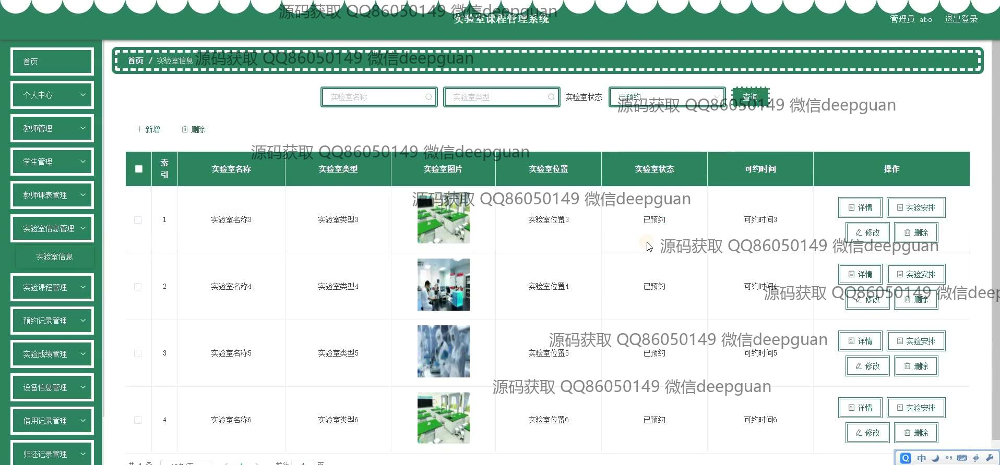
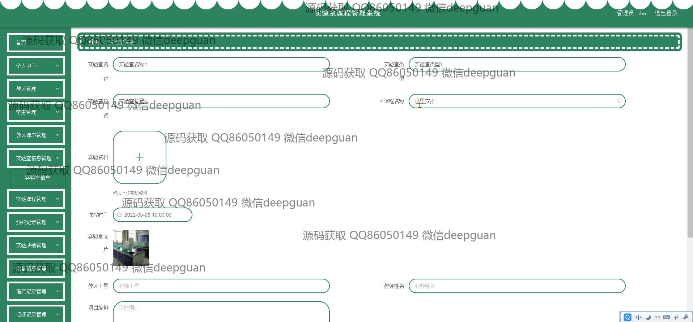
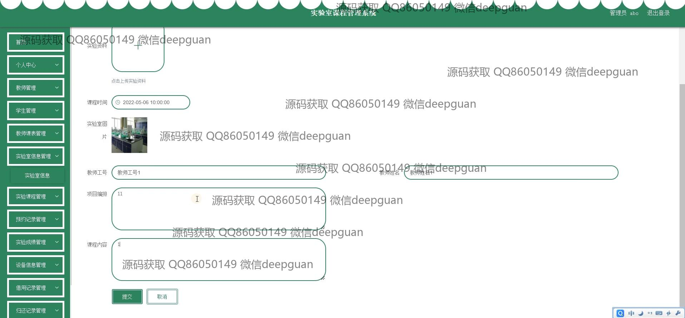
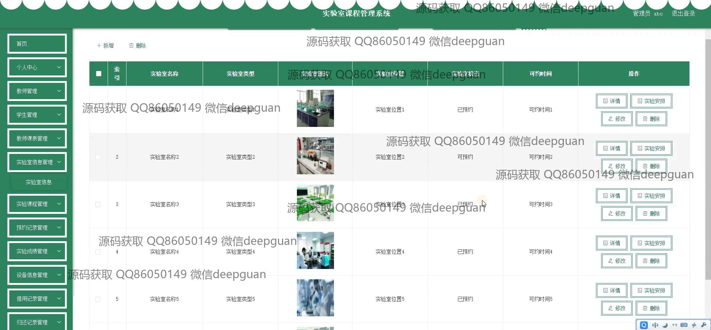
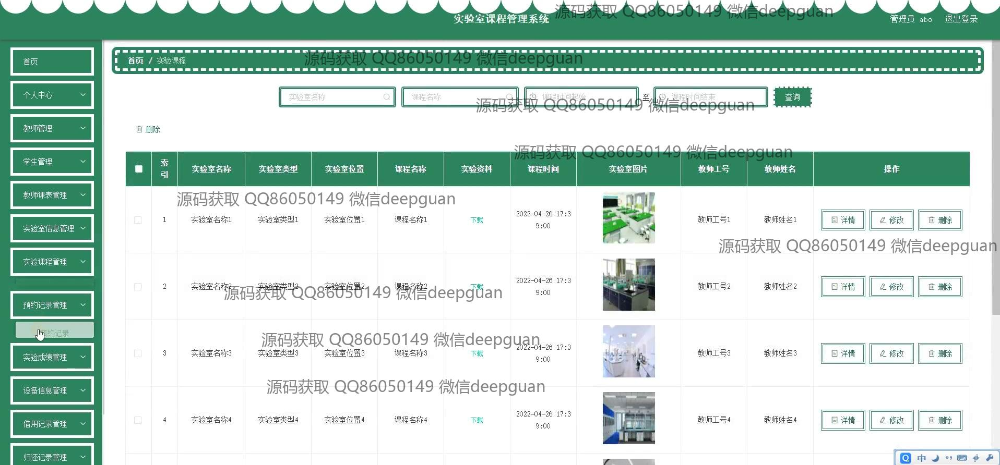
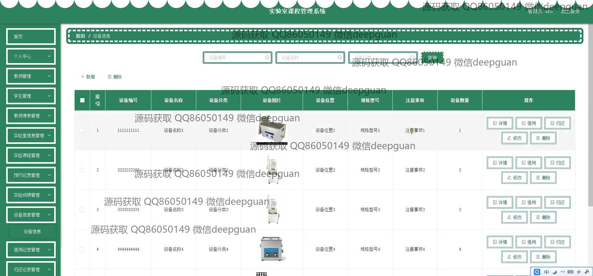
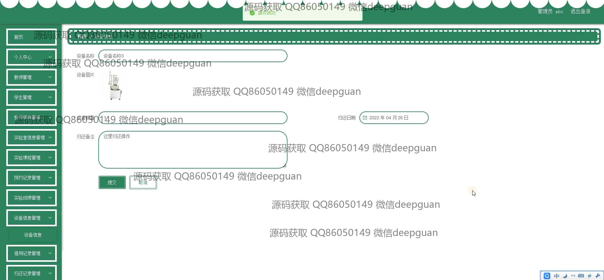
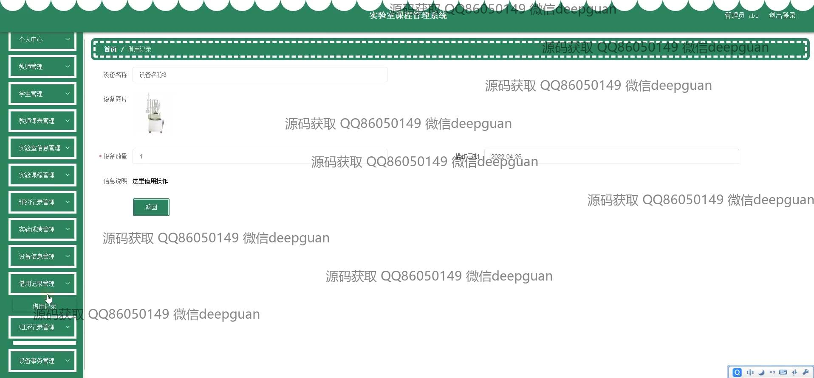
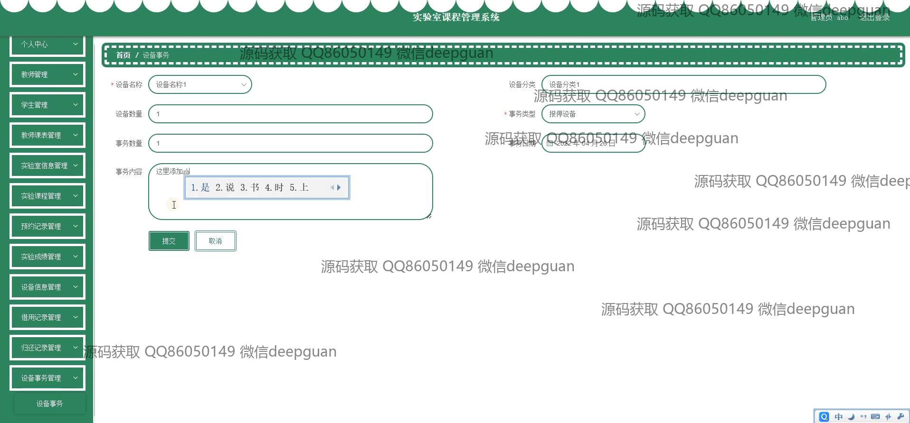
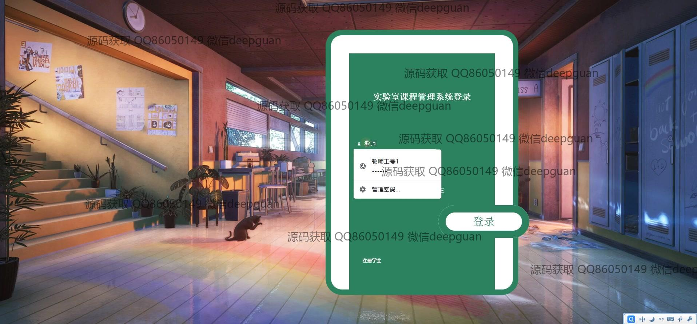
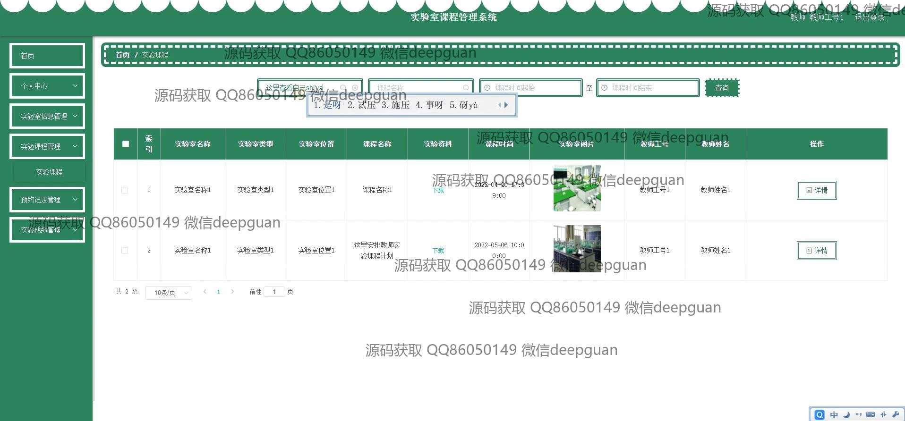
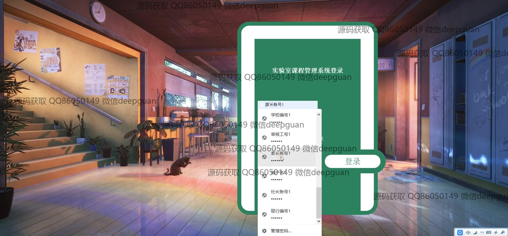
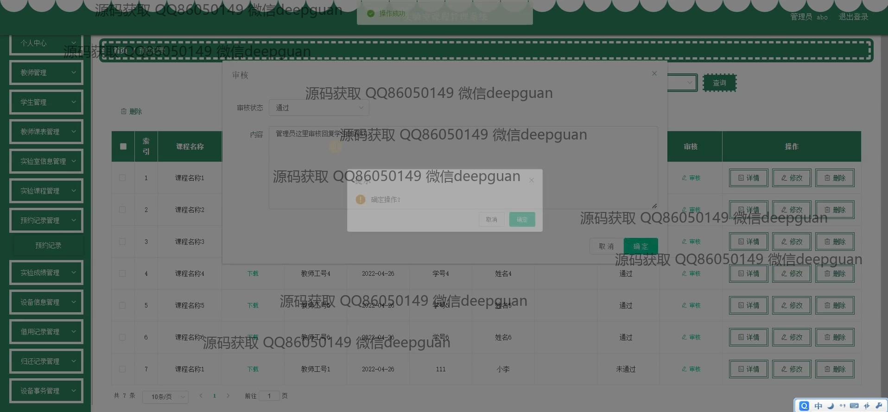
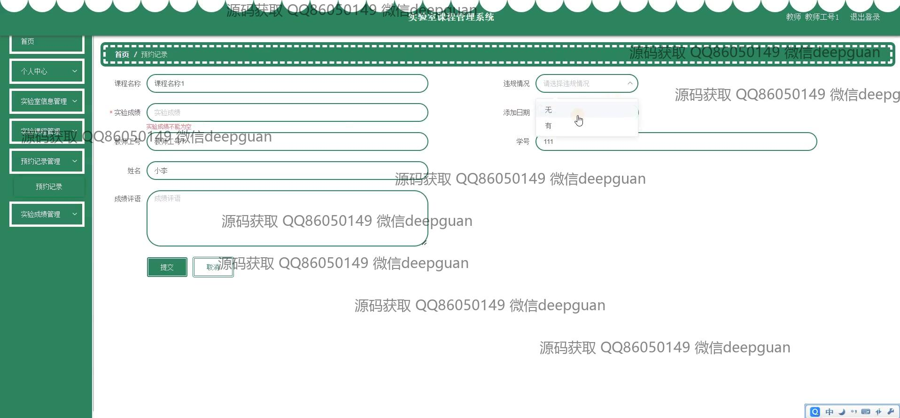
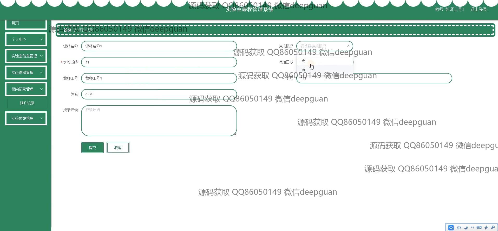

本代码来源于网络,仅供学习参考使用!

